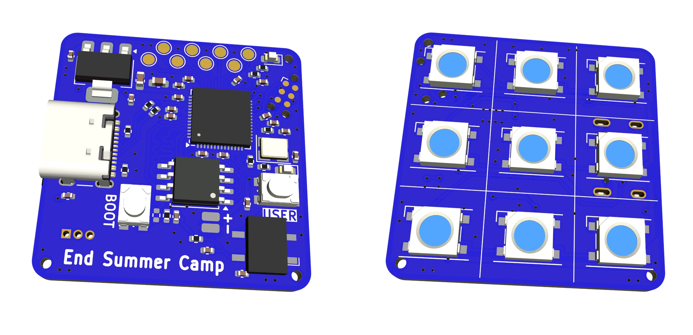

# End Summer Camp - Mini Badge 2024

This is the first official ESC badge with a microcontroller!

## Hardware Features

- RP2040 microcontroller
- 9 RGB(W) LEDs
- IR transmitter and receiver
- 2 buttons
- USB-C connector
- JTAG and expansion pads

## Software Features

- Fully featured and composable animation engine for light effects and patterns
- More than 12 of built-in light animations, more can be added easily
- IR remote control support (NEC and Samsung NEC), commands can be added easily
- IR transmitter (NEC), badge-to-badge communication
- USB CDC for debug and control
- USB MIDI for control (you can send standard MIDI messages to control the lights)
- Automatic overheating protection
- Torchlight mode (power up with the button held down)
- to be continued...

## Light Effects

The badge emits different light effects. Gently press the USER key to select the next effect.

1. hacker glider I'm Blue (default)
2. hacker glider Hulk
3. hacker glider Redder
4. hacker glider I'm Blue pulsing
5. IO SONO GIORGIA
6. hacker glider pride
7. gigaPride
8. gigaRedder
9. gigaHulk
10. gigaBlue
11. gigaWhite (torch)
12. under arrest
13. leds off

## Project Structure

- `antani_hw/`: Contains the hardware design files, KiCad project.
- `antani_sw/`: Contains the firmware for the badge.
- `minibadge-cli/`: Contains the CLI tool to interact with the badge from a computer.
- `docs/`: Contains all the documentation for the project.

## Project Credits

Special credits:

- [Kezii](https://github.com/Kezii) - Supreme Badge Warlord, Supreme Circuitry Alchemist, Soldering Paste Virtuoso
- sebastiano: Project Heritage Continuity Director, Glider Specifications and Quality Assurance Authority, Grandmaster of Antani

All credits:

- [arves100](https://github.com/arves100) - Crisis Simulation Director, RAEE Generator Director
- [neonsn0w](https://github.com/neonsn0w) - RAEE Generator Operator
- [Bildcraft1](https://github.com/Bildcraft1) - RAEE Generator Operator, Chief of Sound Engineering
- claudio - Chief Troop Nutrition & Gastronomic, Patato-Logistics Manager, Culinary Trade Secrets Trustkeeper
- [davidecaminati](https://github.com/davidecaminati) - Scam Advisor, Print Specialist
- DragonEnergy - Troop Nutrition Chemistry Master, Potato Pipeline Operator
- [d4nyl0](https://github.com/d4nyl0) - Metal Fusion Operator, User Documentation Auditor
- DuckDuckGo's AI - Human Capital Elevator
- [e1c4mp3r0](https://github.com/e1c4mp3r0) - Lights FX Terminologist, User Documentation Layout Supervisor
- [k3lite](https://github.com/k3lite) - Badge Flame Leader, Metal Fusion Operator, User Documentation Auditor
- fagianodorato99 - Fotonic Radiators Deployer
- [LucentW](https://github.com/LucentW) - Chief Ethereal Access Sigils Provisioner
- [MassiveBox](https://github.com/MassiveBox) - VIP Stress Management Specialist
- Mike - Troop Nutrition Operator, Potato Pipeline Operator
- [ru-ka](https://github.com/ru-ka) - Head of VIP Fashion Expression, Nutritional Lifestyle VIP Coach
- [valerio](https://boz.reyboz.it/) - Chief User Documentation Auditor
- ZioFrenk - Monocular Fotonic Radiators Deployer

## License

The software is released under the GNU Genera Public License, version 3.

The hardware schema is released under the CERN Open Hardware Licence Version 2 - Permissive.
